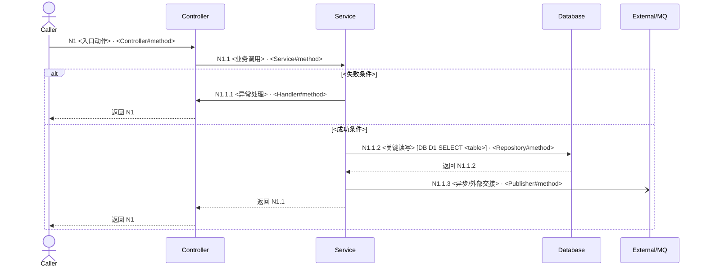

# Java 代码流程梳理文档标准与模板

## 输出原则

- 文档服务于用户指定场景，不追求全仓库百科全书。
- 业务时序图和代码调用树始终同时输出，并与关键节点表使用完全相同的层级路径编号。编号负责关联，文字负责阅读；面向读者的视图不得只显示编号。
- 时序图表达跨层先后、返回、事务和异步交接；文本树表达实际调用层级；表格承载证据。只有关键分支/状态转换在时序图中不清楚时才补 flowchart，不让多种图重复同一信息。
- 每个事实只设一个详细落点：正文树使用节点编号和符号，不重复完整路径；完整 reference 只在关键节点/日志表出现；摘要和图只写结论。标准档到达用户终点即停止，不为“看起来完整”展开终点后的消费者内部或旁支。
- 代码 reference 使用 `仓库相对路径:行号 · 全限定类#方法(参数类型)`；文档级记录 commit。节点引用声明位置，调用边引用 callsite；默认不复制完整方法，仅在表格不足以证明语义时附最小连续片段。
- 结论将证据状态（代码已证实/运行已证实/推断/未知）与依据来源（项目源码/配置绑定/生成契约/框架契约/运行证据）分开。
- 调用链过长时保留关键节点，在树中用 `… 已折叠 N 个无语义透传调用` 标记；不得折叠分支、异步、事务、外部调用或异常节点。
- 配置项只汇总会改变当前场景流程走向的内容；当前值必须由开发者填写，未提供时保留明确占位，不能用默认值或仓库配置冒充运行值。
- 数据库标记只放在直接执行操作的节点，格式固定为 `[DB <D-ID> <OP> <table>]`；`D-ID` 唯一标识一次 SQL/表操作，时序图、调用树和表操作汇总必须一致，详细 SQL 不塞入图中。

### 编号不变量

- 编号表示“本场景中的一次可见调用”，不表示类、方法或 BFS 发现顺序。根入口固定为 `N1`；子编号按父节点下的源码/业务执行顺序分配。
- `N` 只标识业务调用树中的调用；框架拦截或分派的校验、安全、事务代理、Advice 等使用 `X1`、`X2`，日志使用 `L1`、`L2`。`X` 不参与三视图的 `N` 集合校验。
- 先完成图合并、折叠和调用树，再一次性编号。被折叠说明、分支标题、participant、Note 和单纯返回不创建新编号。
- 同一方法从不同调用点、分支、事务或线程上下文进入时分别编号；循环/递归写 `↩ <已有编号>`，不无限生成后代。
- 每个 `N` 的唯一身份为 `规范符号键@callsite[上下文]`。业务时序图、代码调用树、关键节点表的 `N` 集合必须完全相等，且短代码符号、父节点和身份一致。
- 一个 `N` 在树和节点表中各定义一次，在所有时序图中只有一条首次调用消息；返回消息只引用已有编号。复杂流程可拆多个时序图，但其编号并集仍须与树和节点表相等。
- 横切节点不进入业务树；日志必须关联已有 `N`、已有 `X`、明确边界或“来源未知”。Controller 前置日志不得关联 `N1`。
- `X` 在时序图或说明中首次出现时至少写编号和可读作用，空间允许时使用 `X1 作用 · 短符号`；完整身份以横切表为准，后续可只引用编号。不得用普通同步调用箭头伪造框架分派；异常来源明确时，分支表写 `N1.2.1 -> X3`。
- 生成 Markdown 后运行 `python3 scripts/report_id_audit.py <report.md>`（从 skill 目录执行）；校验失败时先修正编号、父子关系或视图缺项，再交付。

## 图形选择与 Mermaid 规范

按信息关系选最小图形：

- **业务时序图（必需）**：使用 `sequenceDiagram` 展示 HTTP/RPC、Controller→Service→DB、事务返回、MQ/异步和异常回传。
- **文本代码调用树（必需）**：展示完整关键方法层级、兄弟分支和折叠位置；不要再用 Mermaid 画一棵重复的调用树。
- **可选 `flowchart LR/TD`**：关键决策、状态机或补偿分支比参与者时序更重要，且 `alt/opt` 会明显降低可读性时才增加。

时序图规则：

- participant 按职责聚合，如 `Caller`、`Security`、`Controller`、`Service`、`DB`、`Redis`、`MQ`、`Consumer`；不要为每个 helper 建 participant。
- 首次调用消息固定为 `N1.2 业务动作 · Class#35;method`，同时提供编号、可读语义和可核对的短代码符号；不放完整包名、路径或参数签名。Mermaid 代码块中所有字面 `#` 都必须写成 `#35;`，渲染后仍显示为 `#`；调用树、表格和 reference 仍写 `Class#method`。禁用 Mermaid `autonumber`。
- 时序图可以按职责聚合 participant，但不能省略已编号调用；低层 helper 应先在调用树中折叠为无编号说明。返回写“返回 N1.1 + 结果语义”，不重复短代码符号，不创建新编号。
- `->>` 表示代码已证实的同步调用，`-->>` 表示返回；异步消息用 `-)`，并在标签中写“异步”。推断边在标签或 `Note` 中标为“推断/配置驱动”，不要只依赖线型。
- 使用 `alt/else/end` 表达关键互斥分支，`opt` 表达可选路径，`loop` 只表达有业务意义的循环；普通 helper 不进入图。
- 用 `rect` 或 `Note over` 标出事务、线程/进程切换、外部边界和运行时未知；图中不得暗示日志或静态可达边已经真实执行。
- 主图只保留主路径、直接改变结果的失败分支和重要边界。参与者或交叉消息过多时，拆为同步主图与异步/异常子图。

正文模板第 4 节给出最小示例。若补充 flowchart，节点编号仍与时序图、调用树和节点表一致；分支边必须写条件，图例说明实线、推断和异步含义。

## 调用树规范

调用树使用 fenced `text` 代码块。根节点必须是入口；按真实调用关系缩进，而不是按包或类目录分组。每行格式：

`树枝 节点编号 [标签] 类#方法 — 作用 {证据状态}`

花括号写紧凑证据边界：项目方法可写 `{代码已证实}`；只证实调用或绑定而未读取实现时写 `{调用已证实；实现为框架边界}`，不得笼统标成完整实现已证实。

推荐标签：`[入口]`、`[校验]`、`[分支]`、`[事务]`、`[DB]`、`[缓存]`、`[RPC]`、`[消息]`、`[异步]`、`[异常]`、`[返回]`、`[日志]`。

分支条件写在子树前；异步边显式写 `~~异步~~>`；对接口多实现列出候选并标明选择依据或未知。正文模板第 5 节给出与时序图一致的示例。

## 完整模板

````markdown
# <入口或业务场景>代码流程梳理

## 1. 文档信息

| 项目 | 内容 |
| --- | --- |
| 代码库/模块 | `<仓库路径与模块>` |
| 版本基线 | `<commit SHA、分支、工作区是否有未提交改动>` |
| 分析时间 | `<YYYY-MM-DD HH:mm 时区>` |
| 用户意图 | `<一句话说明要回答的问题>` |
| 入口 | `<触发方式 + 类#方法 / URL / topic / job>` |
| 场景条件 | `<成功路径的前提或指定业务条件>` |
| 终点 | `<响应、写库、发消息、任务完成等>` |
| 分析方式 | `<静态 / 静态+运行验证>` |
| 执行强度 | `<快速 / 标准 / 深度，以及选择理由>` |
| 业务入口边界 | `<以 Controller/provider/listener 为主树根；横切前置链单列>` |

## 2. 结论摘要

用 3–6 条说明入口到终点的主线、最重要分支、核心副作用、关键日志覆盖情况与最大的不确定项。不要在这里堆文件清单。

## 3. 范围

- 范围内：`<本次追踪的模块、分支、终点>`
- 范围外：`<未追踪内容及原因>`
- 前置条件：`<配置、数据状态、权限或调用方条件>`

### 3.1 分析覆盖状态（深度档必填，标准档按需）

| 指标 | 数量 | 说明 |
| --- | ---: | --- |
| 已发现节点/调用边 | `<数量>` | `<按规范符号键和调用点去重>` |
| 已完整展开 | `<数量>` | `<direct calls complete>` |
| 已折叠/边界/范围外 | `<数量>` | `<均须有原因>` |
| 未解析 | `<数量>` | `<动态绑定或缺失源码>` |
| 剩余 frontier/partial | `<数量>` | `<静态范围分析完成必须为 0>` |

遍历结论：`<主流程梳理 / 关键路径已覆盖 / 阶段性骨架 / 静态范围分析完成 / 调用图已闭合>`。只有 unresolved 也为 0 才能使用“调用图已闭合”；阶段性骨架须列剩余节点和继续方式。

## 4. 业务时序图



图例：`->>` 为代码已证实的同步调用，`-->>` 为返回，`-)` 为异步交接；推断或配置驱动关系必须在消息或 Note 中显式标注。

### 4.1 关键分支图（可选）

只有关键分支/状态转换无法在主时序图中清楚表达时才增加 `flowchart LR/TD`。不要用它重复主时序。

### 4.2 横切链（适用时）

只列真正覆盖本入口并能拒绝请求、建立身份、改变事务/缓存/重试或映射异常的 filter、interceptor、aspect 和 advice。不要展开框架内部流水线，也不要把框架分派画成业务直接调用。

| 横切节点 | 短符号与作用 | 触发条件 | 影响 | 绑定证据 |
| --- | --- | --- | --- | --- |
| X1 | `<BeanValidation>` — `<请求校验>` | `<进入 Controller 前>` | `<拒绝/放行>` | `<配置、注解或生成契约 reference>` |

## 5. 代码调用链（树形）

横切链在调用树之前单列；调用树本身只展示业务主干、关键分支和边界。深度档若详细子树过长，在正文用 `↳ 详见子图 S1` 折叠，并在附录按子图给出完整关键调用树；被折叠的纯 getter、机械映射和 JDK 调用只记录折叠规则，不逐项输出。

```text
N1 [入口] <Class#method> — <职责> {代码已证实}
└── N1.1 [标签] <Class#method> — <职责> {代码已证实}
    ├── [当 <条件>]
    │   └── N1.1.1 [异常] <Class#method> — <职责> {代码已证实}
    └── [否则]
        ├── N1.1.2 [DB] <Class#method> — <职责> [DB D1 SELECT <table>] {代码已证实}
        └── N1.1.3 [消息] <Class#method> — <职责> {代码已证实}
```

## 6. 关键代码节点

节点表是编号身份的唯一详细定义。短符号必须与调用树、时序图首次调用消息一致；父节点后的 reference 是实际 callsite。同一短符号和 callsite 因分支、事务或线程上下文不同而分别编号时，在“父节点/调用点”单元格追加 `；context=<简短上下文>`；不要把 context 混入业务动作。

| 节点 | 短符号与业务动作 | 父节点/调用点 | 完整 reference | 条件与输入输出 | 副作用/边界 | 证据状态/依据 |
| --- | --- | --- | --- | --- | --- | --- |
| N1 | `<Controller#method>` — `<入口动作>` | `根；<入口绑定 reference>` | `<path:line · fqcn#method(types)>` | `<条件；类型 -> 类型>` | `<响应/无>` | `<代码已证实；项目源码>` |
| N1.1 | `<Service#method>` — `<业务动作>` | `N1；<path:callsite-line>` | `<path:line · fqcn#method(types)>` | `<条件；类型 -> 类型>` | `<事务/无/...>` | `<代码已证实；项目源码>` |
| N1.1.1 | `<Handler#method>` — `<异常处理>` | `N1.1；<path:callsite-line>` | `<path:line · fqcn#method(types)>` | `<失败条件；异常 -> 响应>` | `<返回>` | `<代码已证实；项目源码>` |
| N1.1.2 | `<Repository#method>` — `<关键读写>` | `N1.1；<path:callsite-line>` | `<path:line · fqcn#method(types)>` | `<成功条件；类型 -> 类型>` | `<DB SELECT table>` | `<代码已证实；项目源码/生成契约>` |
| N1.1.3 | `<Publisher#method>` — `<异步交接>` | `N1.1；<path:callsite-line>` | `<path:line · fqcn#method(types)>` | `<成功条件；类型 -> 消息>` | `<MQ/消费者边界>` | `<推断；框架契约>` |

代码片段默认省略。确需展示时只截取支撑当前结论的最小连续范围，并在代码块前标注 reference；不要复制完整类或完整方法作为“证据”。

生成实现或框架代理不在仓库时，完整 reference 单元格写：`声明 reference；绑定/生成配置 reference；调用点 reference；实现来源 generated/framework-proxy；实现位置 unavailable`。不得把框架契约标成某次运行已证实。

### 6.1 数据与返回流

`<Request DTO> -> <Domain command/entity> -> <DO/外部 DTO> -> <Response VO>`

说明关键字段转换、聚合、默认值和最终输出；若终点是写入或消息，说明载荷与持久化映射。

### 6.2 事务、线程与外部边界

| 边界 | 起点 -> 终点 | 行为 | 失败影响 |
| --- | --- | --- | --- |
| `<事务/异步/RPC/DB/MQ>` | `<N1.1 -> N1.1.2>` | `<传播、超时、重试、ack 等>` | `<回滚/降级/重复消费等>` |

### 6.3 数据库表操作汇总

每个直接数据库操作节点、操作类型和表一行；同一 SQL 涉及多表时拆行。表列本身即为本流程的完整涉及表清单；核心操作排在前面，辅助操作不得省略。

| 操作ID | 节点 | 表 | 操作 | 业务目的 | 条件/关键字段 | 事务/结果影响 | SQL/映射证据 | 核心性/理由 |
| --- | --- | --- | --- | --- | --- | --- | --- | --- |
| D1 | N1.1.2 | `<schema.table>` | `SELECT` | `<读取业务对象>` | `<WHERE 条件；主键/业务键>` | `<所在事务；结果如何影响后续>` | `<SQL/XML/annotation reference；Mapper callsite>` | `<核心/辅助；理由>` |

若未发现，写：`目标路径上未发现数据库表操作。`

## 7. 关键分支与异常路径

| 条件/异常 | 起点 | 路径 | 最终行为 | 证据 |
| --- | --- | --- | --- | --- |
| `<条件>` | `<N1.1>` | `<N1.1 -> N1.1.1>` | `<返回/回滚/重试/...>` | `<代码已证实/...>` |

业务代码直接调用的异常处理或 fallback 可以是 `N` 子节点；由 MVC、AOP、listener container 等框架分派的 Advice/callback 使用 `X`，路径写 `<异常来源 N> -> <处理 X>`，不放进业务调用树。

## 8. 关键日志

### 8.1 代码中的关键日志

| 日志/节点 | 稳定日志内容 | 代码位置 | 打印条件 | 事件/时点 | 能证明 / 不能证明 | 关联字段 | 来源/级别/证据与风险 |
| --- | --- | --- | --- | --- | --- | --- | --- |
| L1 / N1.1 | `<源码稳定模板；变量写占位含义>` | `<path:line · symbol>` | `<代码分支 + 日志级别/pointcut；配置未知则说明>` | `<arrival/.../failure>`；`<before/.../on-exception + 相对对象；异常机制按需>` | `<实际证明>` / `<事务提交、消费完成等不可推出事实>` | `<traceId/orderId/...；没有则写无>` | `<code/aspect/...>`；`<INFO/...>`；`<代码已证实；项目源码>`；`<无/敏感风险>` |

前置或横切日志写 `Lx / Xn`；只能证明外部边界时写 `Lx / 边界`；无法定位唯一来源时写 `Lx / 来源未知`。`@ExceptionHandler` 等框架异常分派的时点是 `on-exception`、机制是 `advice`，不是 Java `catch`。

若没有，写：`目标路径上未发现符合关键日志标准的现有日志。`

### 8.2 框架或切面日志

仅列有 filter/interceptor/aspect 注册或 pointcut 证据覆盖当前入口的日志，并说明绑定依据。不适用时写明。

### 8.3 可观测性缺口（可选）

仅当用户关注日志完备性时填写。描述缺失的观测目标、建议位置、建议关联字段和数据安全约束；不要把建议写成项目已有日志。

## 9. 配置项汇总

只列会改变当前场景调用可达性、实现选择、关键分支、重试/降级、异步交接或最终结果的配置。当前值只能由开发者确认；未提供时固定写“待开发者填写”。

| 配置项名称 | 说明 | 作用 | 默认值 | 当前值（开发者填写） | 关联编号（时序图/调用树） | 声明/读取证据 |
| --- | --- | --- | --- | --- | --- | --- |
| `<完整配置 key>` | `<业务含义>` | `<选择实现/进入或跳过 N...>` | `<有依据的值/未知>` | `<待开发者填写/开发者提供：值>` | `<N1.1.2>` | `<配置声明 reference；读取 callsite>` |

若未发现，写：`目标路径上未发现影响流程走向的配置项。`

## 10. 未知项与分析限制

| 未知项 | 原因 | 影响 | 如何验证 |
| --- | --- | --- | --- |
| `<运行时实现选择>` | `<缺少环境配置>` | `<无法确认 N1.1.2 的实际实现>` | `<查看配置/trace/测试>` |

## 11. 证据索引

列出实际读取且支撑结论的核心文件、配置、SQL/XML、测试和获授权的运行证据。不要把仅搜索命中的无关文件列入。

## 12. 自检

- [ ] 入口、场景和终点唯一明确。
- [ ] 主路径从入口连续到达终点。
- [ ] 完成表述与快速/标准/深度执行强度一致。
- [ ] 完成状态正确：frontier/partial 非零为阶段性骨架；unresolved 非零不得称调用图已闭合。
- [ ] 每个已展开方法的相关直接调用点都有边、边界、折叠、范围外或未解析状态。
- [ ] “未发现”类结论已检查接口、实现、父类、配置、AOP 和必要映射，并注明检索范围。
- [ ] 业务时序图、代码调用树、节点表的 `N` 集合完全相等；每个首次调用同时显示业务动作和短代码符号，父编号、调用身份、语义和证据一致。
- [ ] 时序图每条消息的发送者、接收者、返回方向与代码调用边已人工核对；结构校验脚本不推断 participant 语义。
- [ ] Mermaid 代码块中没有原始 `#`；方法分隔符均写为 `#35;`，块外仍使用 `#`。
- [ ] 横切节点使用 `X` 且未伪装成业务直接调用；每个 `L` 关联到已有 `N`、已有 `X`、边界或来源未知。
- [ ] 分支、异步、事务、外部和异常边界已标注。
- [ ] 所有可达数据库操作均解析到实际表或显式 unresolved；每个 `D-ID` 在时序图、调用树和汇总各出现一次并一致，同节点重复操作同表也不合并。
- [ ] 数据库表操作汇总覆盖全部图中 DB 标记，并写明操作、目的、条件/关键字段、事务/结果影响、证据和核心性。
- [ ] 关键日志来自真实可达代码，建议日志已分开。
- [ ] 每条关键日志写明代码与运行打印条件、时点、能证明和不能证明的事实。
- [ ] 关键日志表将稳定内容和代码位置置于前列，便于直接检索和核对。
- [ ] 所有改变流程走向的配置项均写明名称、说明、作用、默认值、开发者填写的当前值、关联 `N` 编号和证据；未提供当前值时没有冒充运行值。
- [ ] 所有推断与未知均显式标注。
- [ ] 流程文档没有扩张为用户未请求的缺陷审计。
- [ ] 文件、符号和行号已复核。
````

## 缩放规则

- 快速档优先在对话中输出，通常不生成覆盖统计或完整模板；保留主流程、关键节点、数据库表操作汇总、关键日志、配置项汇总和限制即可。
- 标准档强制保留范围与结论、业务时序图、调用树、关键节点、数据库表操作汇总、关键日志、配置项汇总、分支/边界/未知；数据库和配置为空也保留一句明确结论。完整 reference 只在节点、数据库、日志和配置表详细出现。
- 简单同步链的标准档通常可控制在约 80–150 行；这只是去重信号而非硬限制。明显超出时先合并重复的范围、配置、边界和证据索引，不得删减必要证据或硬截断。
- 简单流程可以合并“数据流”和“边界”小节，但不得删除数据库表操作汇总、关键日志、配置项汇总和未知项结论。
- 复杂流程优先拆为同步主时序与异步/异常子图，不要在一个 Mermaid 图中塞入全部参与者和分支。
- 用户只需快速走读时，也保留精简业务时序图和精简代码调用树；摘要、关键节点、数据库表操作汇总、关键日志、配置项汇总和未知项不可省略，其余表格按需压缩。
