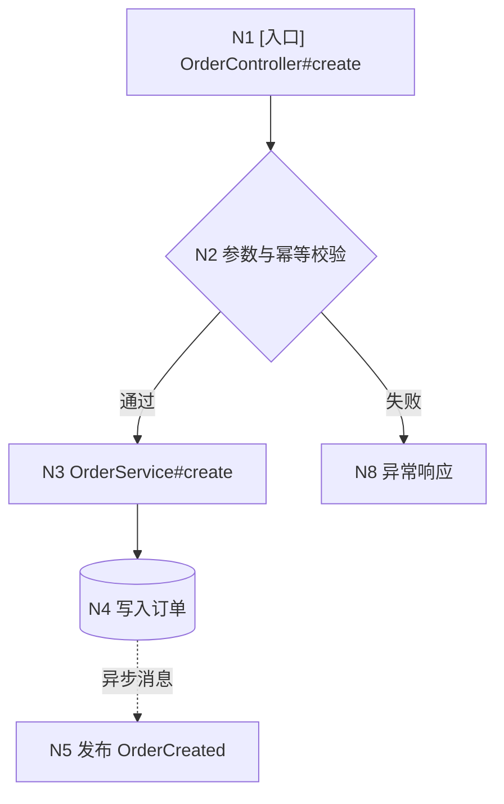
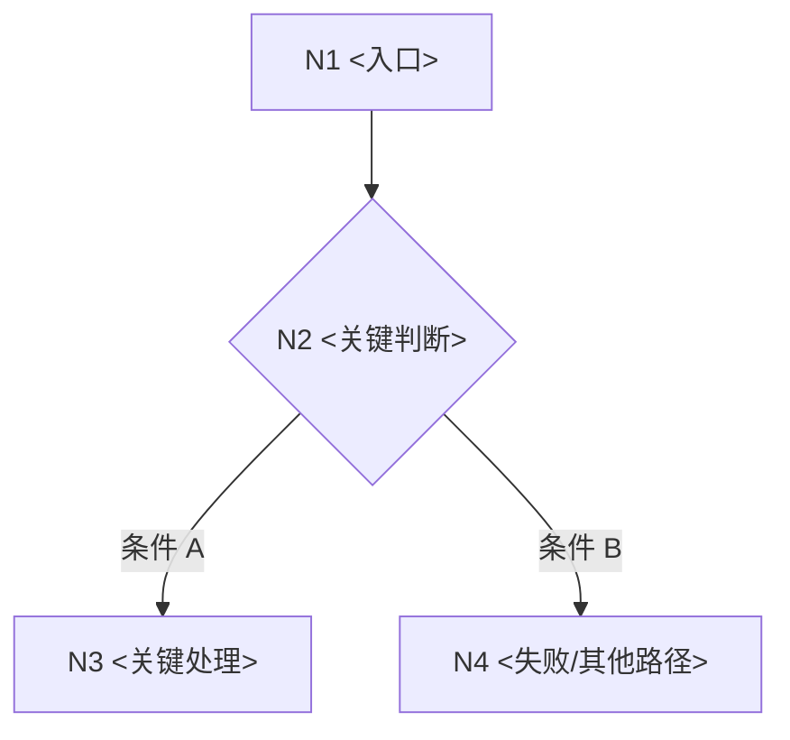

# Java 代码流程梳理文档标准与模板

## 输出原则

- 文档服务于用户指定场景，不追求全仓库百科全书。
- Mermaid 流程图、调用树、关键节点表使用同一组 `N1`、`N2`……编号。
- Mermaid 表达控制流和边界；文本树表达实际调用层级；表格承载可检索的证据细节。不要用三种形式重复相同长篇说明。
- 文件引用使用仓库相对路径与行号，如 `module/src/.../OrderService.java:87`；行号无法稳定获得时使用 `类#方法`。
- 结论明确区分“代码已证实 / 运行已证实 / 推断 / 未知”。
- 调用链过长时保留关键节点，在树中用 `… 已折叠 N 个无语义透传调用` 标记；不得折叠分支、异步、事务、外部调用或异常节点。

## Mermaid 规范

使用 `flowchart TD` 或 `flowchart LR` 展示用户场景的代码流程：

- 节点 ID 使用简单 ASCII，如 `N1`、`N2`；显示文本放在引号中。
- 判断使用菱形 `{}`，数据库使用 `[(...)]`，外部系统或消息系统用独立 `subgraph` 或明确标签。
- 实线箭头表示代码已证实的同步调用；`-.->` 表示推断/配置驱动边；异步边标注“异步/消息”。在图例中解释实际使用的线型。
- 分支边标注条件；异常路径使用 `|异常|`、`|失败|` 等标签。
- 一个图只表达一个主要场景。节点超过约 15 个或交叉边明显影响阅读时，拆成主流程图和异步/异常子图。
- Mermaid 标签避免放入泛型尖括号、未转义引号和大段代码；复杂签名放到节点表。

基本形状：



## 调用树规范

调用树使用 fenced `text` 代码块。根节点必须是入口；按真实调用关系缩进，而不是按包或类目录分组。每行格式：

`树枝 节点编号 [标签] 类#方法 — 作用（path:line） {证据状态}`

推荐标签：`[入口]`、`[校验]`、`[分支]`、`[事务]`、`[DB]`、`[缓存]`、`[RPC]`、`[消息]`、`[异步]`、`[异常]`、`[返回]`、`[日志]`。

分支条件写在子树前；异步边显式写 `~~异步~~>`；对接口多实现列出候选并标明选择依据或未知。示例：

```text
N1 [入口] OrderController#create — 接收创建请求（.../OrderController.java:42）{代码已证实}
└── N2 [事务] OrderApplicationService#create — 编排创建流程（.../OrderApplicationService.java:61）{代码已证实}
    ├── [当 requestId 已存在]
    │   └── N3 [分支][返回] IdempotencyService#findResult — 返回历史结果（...:88）{代码已证实}
    └── [当 requestId 不存在]
        ├── N4 [DB] OrderMapper#insert — 写入订单（.../OrderMapper.xml:35）{代码已证实}
        └── ~~异步~~> N5 [消息] DomainEventPublisher#publish — 发布事件（...:104）{代码已证实}
            └── N6 [消息] OrderCreatedListener#onMessage — 消费事件（...:47）{推断：运行时 topic 配置未知}
```

## 完整模板

````markdown
# <入口或业务场景>代码流程梳理

## 1. 文档信息

| 项目 | 内容 |
| --- | --- |
| 代码库/模块 | `<仓库路径与模块>` |
| 版本基线 | `<commit SHA、分支、工作区是否有未提交改动>` |
| 分析时间 | `<YYYY-MM-DD HH:mm 时区>` |
| 用户意图 | `<一句话说明要回答的问题>` |
| 入口 | `<触发方式 + 类#方法 / URL / topic / job>` |
| 场景条件 | `<成功路径的前提或指定业务条件>` |
| 终点 | `<响应、写库、发消息、任务完成等>` |
| 分析方式 | `<静态 / 静态+运行验证>` |
| 执行强度 | `<快速 / 标准 / 深度，以及选择理由>` |

## 2. 结论摘要

用 3–6 条说明入口到终点的主线、最重要分支、核心副作用、关键日志覆盖情况与最大的不确定项。不要在这里堆文件清单。

## 3. 范围

- 范围内：`<本次追踪的模块、分支、终点>`
- 范围外：`<未追踪内容及原因>`
- 前置条件：`<配置、数据状态、权限或调用方条件>`

### 3.1 分析覆盖状态（深度档必填，标准档按需）

| 指标 | 数量 | 说明 |
| --- | ---: | --- |
| 已发现节点/调用边 | `<数量>` | `<按规范符号键和调用点去重>` |
| 已完整展开 | `<数量>` | `<direct calls complete>` |
| 已折叠/边界/范围外 | `<数量>` | `<均须有原因>` |
| 未解析 | `<数量>` | `<动态绑定或缺失源码>` |
| 剩余 frontier/partial | `<数量>` | `<深度档完整交付必须为 0>` |

遍历结论：`<主流程梳理 / 关键路径已覆盖 / 声明范围内完整 / 阶段性骨架>`。如果是阶段性骨架，列出最高优先级的剩余节点和继续分析方式，不得使用“完整调用链”表述。

## 4. 代码流程图



图例：`-->` 代码已证实的同步调用；`-.->` 推断或配置驱动调用；带“异步/消息”的边表示线程或进程边界。

## 5. 调用链

```text
N1 [入口] <Class#method> — <职责>（<path:line>）{代码已证实}
└── N2 [标签] <Class#method> — <职责>（<path:line>）{代码已证实}
    ├── [当 <条件>]
    │   └── N3 ...
    └── [否则]
        └── N4 ...
```

## 6. 关键代码节点

| 节点 | 文件与符号 | 角色 | 进入条件 | 输入 -> 输出 | 状态变化/副作用 | 关键调用或返回 | 证据 |
| --- | --- | --- | --- | --- | --- | --- | --- |
| N1 | `<path:line / Class#method>` | `<入口/校验/...>` | `<条件>` | `<类型 -> 类型>` | `<无/写库/...>` | `<下一节点或返回>` | `<代码已证实/...>` |

### 6.1 数据与返回流

`<Request DTO> -> <Domain command/entity> -> <DO/外部 DTO> -> <Response VO>`

说明关键字段转换、聚合、默认值和最终输出；若终点是写入或消息，说明载荷与持久化映射。

### 6.2 事务、线程与外部边界

| 边界 | 起点 -> 终点 | 行为 | 失败影响 |
| --- | --- | --- | --- |
| `<事务/异步/RPC/DB/MQ>` | `<N2 -> N3>` | `<传播、超时、重试、ack 等>` | `<回滚/降级/重复消费等>` |

## 7. 关键分支与异常路径

| 条件/异常 | 起点 | 路径 | 最终行为 | 证据 |
| --- | --- | --- | --- | --- |
| `<条件>` | `<N2>` | `<N2 -> N4 -> ...>` | `<返回/回滚/重试/...>` | `<代码已证实/...>` |

## 8. 关键日志

### 8.1 代码中的关键日志

| 节点 | 位置 | 级别 | 稳定关键词/模板 | 触发条件 | 关联字段 | 能回答的问题 | 风险/备注 |
| --- | --- | --- | --- | --- | --- | --- | --- |
| N2 | `<path:line / Class#method>` | `<INFO/WARN/...>` | `<代码中的模板稳定部分>` | `<何时打印>` | `<traceId/orderId/...>` | `<证明到达/分支/结果/失败>` | `<无/敏感字段风险>` |

若没有，写：`目标路径上未发现符合关键日志标准的现有日志。`

### 8.2 框架或切面日志

仅列有 filter/interceptor/aspect 注册或 pointcut 证据覆盖当前入口的日志，并说明绑定依据。不适用时写明。

### 8.3 可观测性缺口（可选）

仅当用户关注日志完备性时填写。描述缺失的观测目标、建议位置、建议关联字段和数据安全约束；不要把建议写成项目已有日志。

## 9. 配置与运行时选择

| 配置/条件 | 影响节点 | 当前结论 | 证据或缺口 |
| --- | --- | --- | --- |
| `<profile/qualifier/feature flag/topic/...>` | `<N3>` | `<选择实现/改变分支>` | `<配置位置或未知>` |

## 10. 未知项与分析限制

| 未知项 | 原因 | 影响 | 如何验证 |
| --- | --- | --- | --- |
| `<运行时实现选择>` | `<缺少环境配置>` | `<无法确认 N3/N4 哪个执行>` | `<查看配置/trace/测试>` |

## 11. 证据索引

列出实际读取且支撑结论的核心文件、配置、SQL/XML、测试和获授权的运行证据。不要把仅搜索命中的无关文件列入。

## 12. 自检

- [ ] 入口、场景和终点唯一明确。
- [ ] 主路径从入口连续到达终点。
- [ ] 完成表述与快速/标准/深度执行强度一致。
- [ ] 深度档的 frontier 与 partial 均为 0；否则文档已明确标为阶段性骨架。
- [ ] 每个已展开方法的相关直接调用点都有边、边界、折叠、范围外或未解析状态。
- [ ] Mermaid、调用树、节点表编号一致。
- [ ] 分支、异步、事务、外部和异常边界已标注。
- [ ] 关键日志来自真实可达代码，建议日志已分开。
- [ ] 所有推断与未知均显式标注。
- [ ] 文件、符号和行号已复核。
````

## 缩放规则

- 快速档优先在对话中输出，通常不生成覆盖统计或完整模板；保留主流程、关键节点、关键日志和限制即可。
- 简单流程可以合并“数据流”“边界”“配置”小节，但不得删除关键日志和未知项结论。
- 复杂流程按主场景拆文档或增加附录，不要在一个 Mermaid 图中塞入全部分支。
- 用户只需快速走读时，保留摘要、范围、流程图、调用树、关键节点、关键日志和未知项；其余表格按需压缩。
